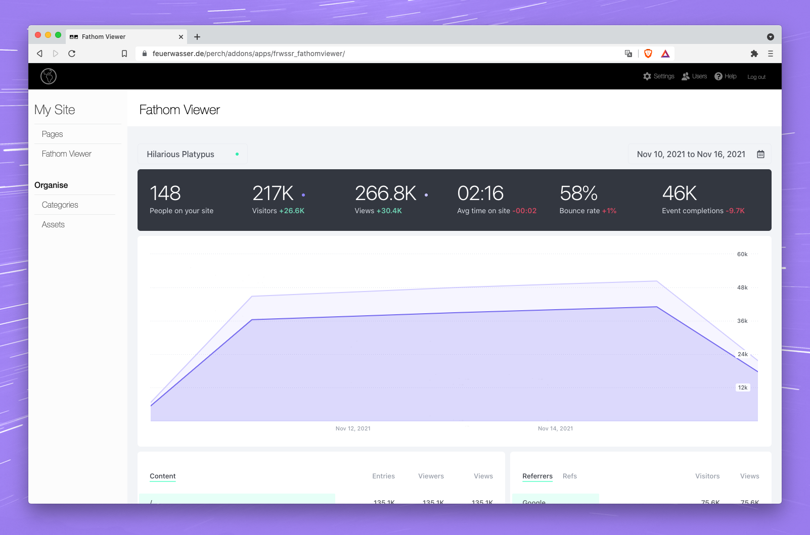

# FEUERWASSER Fathom Viewer (frwssr_fathomviewer)
An app to display a [Fathom Analytics](https://usefathom.com/) shared dashboard in [PerchCMS](https://grabaperch.com/).

## Installation

1. Download zip archive and extract locally.
2. Create a `frwssr_fathomviewer` folder in the `/perch/addons/apps/` folder of your *Perch* install.
3. Copy the files `_version.php`, `admin.php`, `index.php`, as well as the folders `js` and `lang` (along with their respective contents) to the `/perch/addons/apps/frwssr_fathomviewer` folder.
4. Reload the Perch Admin interface. *Fathom Viewser* should now show in you apps listing on the left.

## Usage
Got to your *Perch* settings page, scroll to the very bottom and fill in at least the ID of the shared site you wish to load.
If the shared dashboard is set to `Private` (in the *Fathom* account), also supply the required password.

### Notes
- If you are seeing an error “419 – Page Expired” (with a floating cat), you have most likely not set the password required for this particular dashboard. Add that to the *Fathom Viewer* section at the bottom of the *Perch* settings page. Putting in your password in the iFrame, displaying the *Fathom* dashboard, it will not work.
- This app was developed under Perch (Standard) Version 3.2 on a server running PHP 7.4.25. Most likely it will run below these versions. Nothing fancy going on here.
Anyway: **Use at own risk!**

# Shout-outs
- I snuck a peek or two at *Fathom’s* own [WordPress integration](https://usefathom.com/docs/integrations/wordpress). So many thanks to Jack and Paul for letting me use their (not so?) secret URL pattern to make the dashboard work with a password here. 🙌
- Resizing of the iFrame in the *Fathom Viewer* app is provided by David J. Bradshaw’s *iFrame Resizer* script. For details please go to [iFrame Resizer’s GitHub page](https://github.com/davidjbradshaw/iframe-resizer).

# License
This project is free, open source, and GPL friendly. You can use it for commercial projects, for open source projects, or for almost whatever you want, really.

# Donations
This is free software, but it took some time to develop. If you use it, please let me know—I live off of positive feedback…and chocolate.
If you appreciate the app and use it regularly, feel free to [buy me some sweets](https://paypal.me/nlsmlk).

# Issues
Create a GitHub Issue: https://github.com/frwssr/frwssr_fathomviewer/issues or better yet become a contributor.

Developer: [Nils Mielke](mailto:nils.m@feuerwasser.de) ([@nilsmielke](https://twitter.com/nilsmielke)) of [FEUERWASSER](https://www.feuerwasser.de) ([@frwssr](https://twitter.com/frwssr))